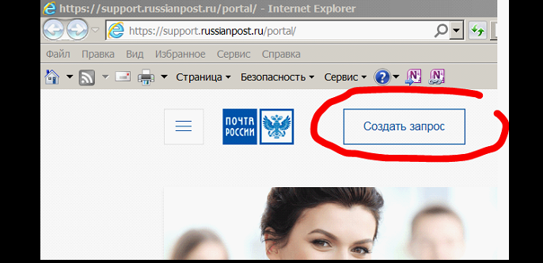
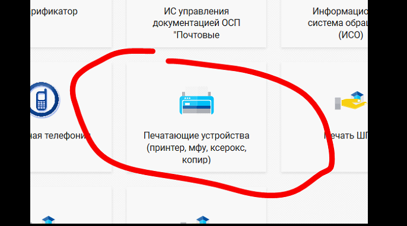
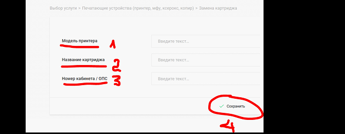

# lesson OG02 homework
 ## ДЗ к уроку OG02

Это пример файла README для проекта. Ниже приведен пример
инструкции для пользователя, оформленный в соответствии
с сиснтаксисом языка разметки Markdown (образец разработан мной для обучения пользователей).

# ИНСТРУКЦИЯ по созданию заявки на картридж

1. Запускаем ярлык на Рабочем столе:

2. В правом верхнем углу браузера нажимаем кнопку**Создать запрос**

3. Выбираем вид услуги - для замены картриджа выбираем **Печатающие устройства**

4. Выбираем вид запроса:

5. Заполняем указанные поля и нажимаем кнопку **Сохранить**

### Для картриджей МФУ указываем:
- Модель принтера: *Samsung Xpress M2870FD*;
- Название картриджа: *MLT-D115L*;
- Номер кабинета: *номер кабинета*.

### Запрос создан!
По результатам действий с запросом вы будете получать уведомления в электронную почту.

[Оригинал инструкции](https://github.com/yural64/lesson-OG02-homework/blob/664b8598e73f46a2c49ffde567690092bbe4e5f5/instructions_for_ordering_the_cartridge.docx).